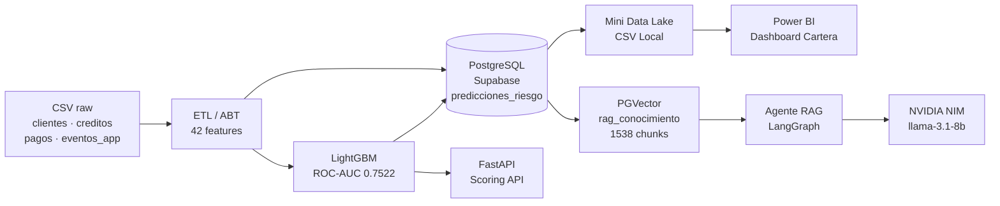
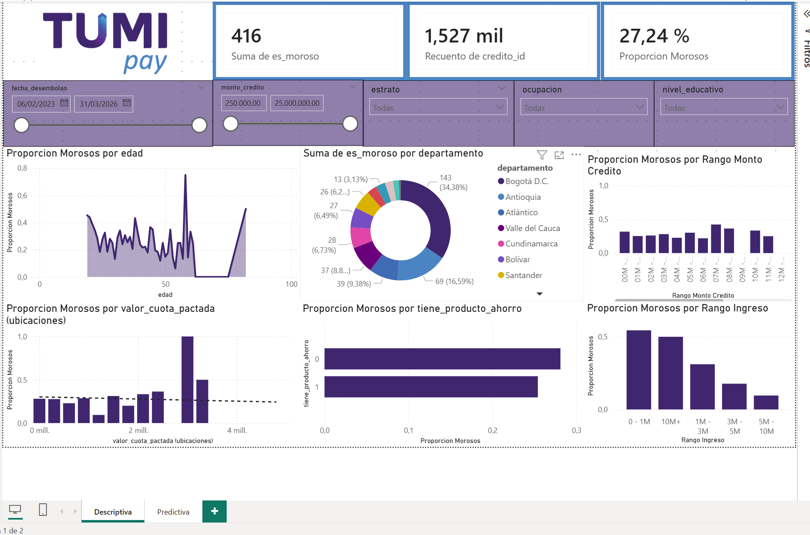
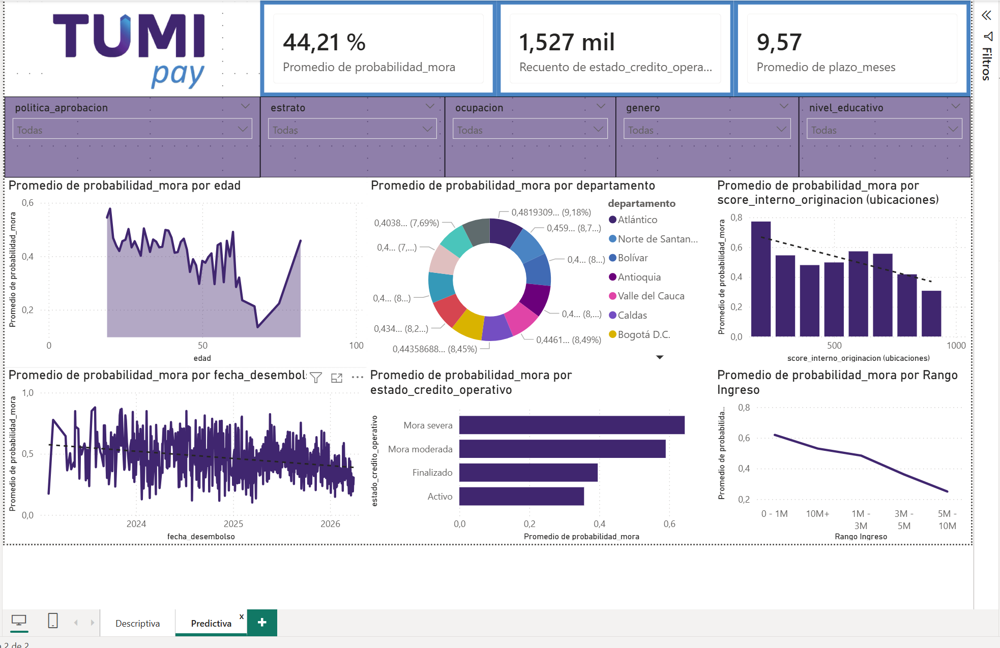

# TumiPay — Risk Engine & Financial AI Advisor


Motor de riesgo de crédito de extremo a extremo para calculo de riesgo crediticio. El sistema integra un pipeline de datos completo (ETL → Feature Engineering → ML → API), un dashboard de cartera en Power BI y un agente conversacional RAG sobre base de conocimiento financiero. La arquitectura, el diseño analítico y las decisiones metodológicas son de autoría propia; las herramientas de IA generativa se utilizaron como aceleradoras del desarrollo de código, sin sustituir el criterio técnico.

## 📋 Tabla de Contenidos

1. [Resumen Ejecutivo](#1-resumen-ejecutivo)
2. [Inicio Rápido y Ejecución](#2-inicio-rápido-y-ejecución)
3. [Arquitectura del Sistema](#3-arquitectura-del-sistema)
4. [Descripción de Módulos y Scripts](#4-descripción-de-módulos-y-scripts)
5. [Ingeniería de Datos y Calidad](#5-ingeniería-de-datos-y-calidad)
6. [Modelo de Riesgo — Resultados](#6-modelo-de-riesgo--resultados)
7. [Agente RAG Financiero](#7-agente-rag-financiero)
8. [SQL y Capa Analítica](#8-sql-y-capa-analítica)
9. [Dashboard de Power BI](#9-dashboard-de-power-bi)
10. [Limitaciones y Mejoras](#10-limitaciones-y-mejoras)
11. [Prácticas de Desarrollo y Uso de IA](#11-prácticas-de-desarrollo-y-uso-de-ia)

---

## 1. Resumen Ejecutivo

**TumiPay Risk Engine** es un sistema de scoring crediticio diseñado para operar en el momento de originación — antes del desembolso. A partir de cuatro fuentes de datos operativas (`clientes`, `creditos`, `pagos`, `eventos_app`), el sistema construye una Analytical Base Table (ABT) con 42 variables, entrena un modelo LightGBM libre de data leakage y expone predicciones en tiempo real a través de una API REST. Una capa de Business Intelligence y un agente conversacional complementan el motor de riesgo para el equipo de negocio.

| Capa | Componente | Descripción |
|---|---|---|
| **Datos** | ETL + ABT | Consolida 4 fuentes raw en una ABT de 42 features con ingeniería anti-leakage. |
| **SQL** | Transformaciones & Analytics | CTEs, window functions y vistas analíticas para BI y auditoría de cartera. |
| **Machine Learning** | LightGBM — Motor de Originación | Predice probabilidad de mora con ROC-AUC de **0.7522**, libre de fuga de información. |
| **API** | FastAPI — Scoring Endpoint | Expone inferencia en tiempo real para integración con sistemas transaccionales. |
| **Visualización** | Dashboard Power BI | Monitor de riesgo de cartera con módulos descriptivo y predictivo. |
| **IA Conversacional** | Agente RAG (LangGraph + PGVector) | Consultas en lenguaje natural sobre portafolio, políticas y fichas de clientes. |

---

## 2. Inicio Rápido y Ejecución

El flujo completo del proyecto está consolidado y orquestado en dos cuadernos: [01_Pipeline_Data_Model.ipynb](01_Pipeline_Data_Model.ipynb) y [02_Pipeline_RAG_LLM.ipynb](02_Pipeline_RAG_LLM.ipynb). Estos notebooks son los puntos únicos de ejecución para cargar Supabase, crear la vista de BI, entrenar el modelo, poblar `predicciones_riesgo`, exportar el mini data lake CSV para Power BI, indexar el RAG en PGVector y hacer preguntas al LLM.

**Requisitos previos:** Python 3.11+, construir un archivo .env e insertar las variables de entorno según el ejemplo. 

```bash
# 1. Clonar el repositorio
git clone https://github.com/danezv/proyecto-data-scientist.git
cd proyecto-data-scientist

# 2. Configurar variables de entorno
cp .env.example .env
# Completar NVIDIA_API_KEY y DATABASE_URL en .env

# 3. Instalar dependencias
python -m venv .venv
source .venv/bin/activate        # En Windows: .venv\Scripts\activate
pip install -r requirements.txt

# 4. Ejecutar el orquestador principal (pobla BD, entrena modelo, genera CSV)
# y luego el de LLM (carga RAG y prueba el LLM)
jupyter nbconvert --to notebook --execute --inplace 01_Pipeline_Data_Model.ipynb
jupyter nbconvert --to notebook --execute --inplace 02_Pipeline_RAG_LLM.ipynb

# 5. (Opcional) Levantar la API de scoring en vivo
uvicorn src.main:app --reload
```

> **Nota sobre Base de Datos:**  Basta con configurar un string de conexión de Supabase o cualquier PostgreSQL (con pgvector) en la variable de entorno `DATABASE_URL`. (Se muestra como insertarlo usando el .env.example)

---

## 3. Arquitectura del Sistema
├── 01_Pipeline_Data_Model.ipynb  # Pipeline 01: Ingesta, limpieza, ABT y Machine Learning
├── 02_Pipeline_RAG_LLM.ipynb     # Pipeline 02: Indexación en PGVector e inferencia del RAG+LLM
├── src/
│   ├── config.py                 # Configuración centralizada (pydantic-settings)
│   ├── ingesta.py                # Carga de CSVs con tipado estricto y validación
│   ├── procesamiento.py          # Limpieza, estandarización y tratamiento de outliers
│   ├── consolidacion.py          # Feature engineering y construcción de la ABT
│   ├── train_mora.py             # Pipeline ML: split temporal, entrenamiento y evaluación
│   ├── rag_agent.py              # Agente conversacional RAG con LangGraph + PGVector
│   └── main.py                   # FastAPI: endpoints de scoring e inferencia
├── scripts/
│   ├── load_raw_supabase.py      # Carga los CSVs raw a Supabase (PostgreSQL)
│   ├── load_powerbi_predictions.py # Escribe predicciones y genera mini data lake CSV
│   └── populate_rag.py           # Indexa chunks de conocimiento en el vector store
├── sql/
│   └── transformaciones.sql      # Transformaciones analíticas, vistas y ABT en SQL puro
├── notebooks/
│   ├── 00_carga_base_supabase.ipynb    # Notebook auxiliar de validación de carga raw
│   ├── 01_powerbi_predicciones.ipynb   # Notebook auxiliar de validación de predicciones
│   ├── 1_eda_y_calidad.ipynb           # Análisis exploratorio y calidad de datos
│   ├── 2_modelado_y_evaluacion.ipynb   # Iteraciones de modelado y métricas
│   └── 02_aporte_adicional_rag_llm.ipynb # Notebook auxiliar de demo RAG
├── docs/
│   ├── diccionario_datos.md      # Diccionario de campos por tabla y reglas anti-leakage
│   └── analisis_arquitectura_modelado.md
├── dashboard/
│   ├── capturas/                 # Capturas del dashboard Power BI
│   └── *.pbix                    # Dashboard conectado a data/processed/powerbi
├── data/
│   ├── raw/                      # Datos originales entregados con la prueba
│   └── processed/                # ABT y mini data lake Power BI en CSV
├── models/                       # modelo_mora.pkl serializado (generado por el pipeline — ver models/README.md)
├── supabase/                     # Migraciones DDL para Supabase
└── .env.example                  # Plantilla de variables de entorno
```



---

## 4. Descripción de Módulos y Scripts

### `src/` — Núcleo del Sistema

| Módulo | Responsabilidad |
|---|---|
| `config.py` | Define `Settings` con `pydantic-settings`: lee variables de entorno (`.env`), expone `DATABASE_URL`, `NVIDIA_API_KEY`, `CUTOFF_DATE` y rutas de artefactos. Punto único de configuración para todos los módulos. |
| `ingesta.py` | Carga los cuatro CSVs raw con dtype estricto, detecta el BOM UTF-8 y valida la presencia de columnas requeridas antes de retornar DataFrames tipados. |
| `procesamiento.py` | Aplica el `DataCleaner`: estandariza ciudades (mapeo de variantes ortográficas), imputa nulos con mediana, winsoriza `ingreso_mensual_estimado` al P99 y genera la columna `flag_ingreso` para trazabilidad de outliers. |
| `consolidacion.py` | Orquesta el `DataConsolidator`: cruza las cuatro tablas, agrega métricas de comportamiento de pago por crédito, filtra eventos de app previos al desembolso (anti-leakage temporal) y construye la ABT final con 42 features. |
| `train_mora.py` | Pipeline ML completo: define el target `es_moroso` con corte temporal (`fecha_vencimiento ≤ CUTOFF_DATE`, `dias_mora > 30`), realiza split estratificado, entrena `LGBMClassifier` con early stopping, evalúa con ROC-AUC y exporta el modelo a `models/modelo_mora.pkl`. Excluye explícitamente variables post-desembolso. |
| `rag_agent.py` | Implementa el agente conversacional: usa `LangGraph` para el grafo de razonamiento, `PGVector` como retriever semántico y `NVIDIA NIM` (llama-3.1-8b) como LLM generativo. Responde en español sobre portafolio, políticas de cobro y fichas de clientes. |
| `main.py` | API REST con `FastAPI`: expone `POST /predict` para scoring y `POST /ask-analyst` para consultas RAG + LLM sobre el portafolio. |

### `scripts/` — Operaciones de Datos

| Script | Responsabilidad |
|---|---|
| `load_raw_supabase.py` | Lee los CSVs de `data/raw/` y los carga (upsert) en las tablas raw de Supabase (`raw_clientes`, `raw_creditos`, `raw_pagos`, `raw_eventos_app`) usando `SQLAlchemy`. Idempotente: puede ejecutarse múltiples veces sin duplicar registros. |
| `load_powerbi_predictions.py` | Toma el ABT procesado y las predicciones del modelo, escribe `predicciones_riesgo` en PostgreSQL y exporta el mini data lake local en `data/processed/powerbi/` para consumo offline desde Power BI. |
| `populate_rag.py` | Genera chunks de texto a partir de fichas de clientes, estadísticas de cartera y documentos de política. Los embeds con `intfloat/multilingual-e5-small` y los indexa en `PGVector` (`vector_store`). |

### `notebooks/` — Cuadernos del flujo analítico

| Notebook | Rol |
|---|---|
| `1_eda_y_calidad.ipynb` | EDA y diagnóstico de calidad de datos. Detecta nulos, outliers e inconsistencias documentadas en el README §4. |
| `2_modelado_y_evaluacion.ipynb` | Iteración de modelado: definición del target, splits, entrenamiento y métricas. |
| `01_Pipeline_Data_Model.ipynb` | Orquestador principal de datos: ETL → vista BI → ABT → modelo → predicciones → data lake CSV. |
| `02_Pipeline_RAG_LLM.ipynb` | Orquestador del servicio cognitivo: Indexación en PGVector de documentos → pregunta al LLM. |
| `00_carga_base_supabase.ipynb` | Auxiliar de validación de carga raw. No es necesario para ejecutar la entrega. |
| `01_powerbi_predicciones.ipynb` | Auxiliar de validación de predicciones. No es necesario para ejecutar la entrega. |
| `02_aporte_adicional_rag_llm.ipynb` | Auxiliar de demo RAG. |

---

## 5. Ingeniería de Datos y Calidad

### A. Definición Robusta del Target `es_moroso`

La definición del target es la decisión más crítica en un modelo de riesgo de originación. Se evalúa con corte temporal en `2026-04-30`:

```
es_moroso = 1  si  MAX(dias_mora) > 30
               para cuotas con fecha_vencimiento <= '2026-04-30'
```

> **Por qué `fecha_vencimiento` y no `fecha_pago`:** Los créditos en mora activa tienen `fecha_pago = NULL`. Filtrar por `fecha_pago` excluye los peores perfiles de riesgo del entrenamiento, produciendo un modelo sesgado hacia buenos pagadores. El cambio al filtro por `fecha_vencimiento` elevó la tasa de mora evaluada del 25.4% al **27.2%** real, recuperando 29 morosos que el enfoque erróneo descartaba.

### B. Mitigación de Data Leakage

La variable `estado_credito_operativo` (valores: *Activo, Finalizado, Mora moderada, Mora severa*) es conocida **después** del desembolso, no al momento de originar el crédito. Su inclusión en el modelo producía un ROC-AUC ficticio de `0.9844` por filtración directa del target. Esta variable y `email_hash` fueron excluidas estrictamente del feature set. El resultado es un **ROC-AUC real de 0.7522**, sólido y reproducible en producción.

| Escenario | ROC-AUC | Accuracy | Utilidad en producción |
|---|---|---|---|
| **Con leakage** (`estado_credito_operativo` incluido) | 0.9844 | 97% | Nula — aprende el target directamente |
| **Sin leakage** (modelo actual) | **0.7522** | **73%** | **Alta — predice en originación real** |

### C. Calidad y Limpieza de Datos

| Problema detectado | Solución implementada |
|---|---|
| Ciudades con variantes ortográficas (*'bogot'*, *'medellin '*, *'barranquila'*) | Mapeo normalizado en `DataCleaner.clean_clientes` → valores canónicos (*Bogotá*, *Medellín*, *Barranquilla*) |
| Nulos en `ingreso_mensual_estimado` y `score_externo` | Imputación con mediana del conjunto (robusta ante outliers) |
| Nulos en `producto_credito` | Categoría explícita `'Desconocido'` para trazabilidad |
| Outlier `ingreso_mensual_estimado = 120M COP` (CL00493, estrato 2) | Raw conservado intacto; vista `v_clientes_bi` winsoriza a P99 y asigna `flag_ingreso = 'error_captura'` |

### D. Feature Engineering — Señales Digitales Anti-Leakage

Para enriquecer el perfil del solicitante sin violar la línea temporal, se calculan agregaciones de `eventos_app` **únicamente con eventos anteriores a la fecha de desembolso** del crédito evaluado:

- `prev_evento_pago_fallido`: Intentos fallidos de pago previos al nuevo crédito — señal de tensión financiera.
- `prev_evento_sesion_seg_tot`: Engagement total con la app antes del crédito — proxy de madurez financiera digital.

---

## 6. Modelo de Riesgo — Resultados

El modelo es un `LGBMClassifier` entrenado con split temporal estratificado (80/20) y early stopping. Opera como **motor de originación**: recibe el perfil del solicitante al momento del desembolso y produce una probabilidad de mora.

### Métricas de Evaluación

| Métrica | Modelo actual (leakage-free) |
|---|---|
| **ROC-AUC (Test)** | **0.7522** |
| **Accuracy** | **73%** |
| **Tasa de mora evaluada** | **27.2%** (416 / 1.527 créditos) |

### Distribución de Mora por Rango de Monto de Crédito

| Rango | Créditos totales | En mora | Tasa de mora |
|---|---:|---:|---:|
| < 500K COP | 78 | 19 | 24.4% |
| 500K – 1M | 234 | 80 | **34.2%** |
| 1M – 2M | 496 | 125 | 25.2% |
| 2M – 5M | 553 | 144 | 26.0% |
| 5M – 10M | 139 | 41 | 29.5% |
| > 10M | 27 | 7 | 25.9% |
| **Total** | **1.527** | **416** | **27.2%** |

> El segmento 500K–1M presenta la mayor tasa de mora (34.2%), lo que sugiere mayor riesgo relativo en créditos pequeños. Este insight orienta directamente las políticas de aprobación y pricing por segmento.

### Top Variables más Importantes (Feature Importance — LightGBM)

1. **`score_externo` (127 pts)** — Historial en centrales de riesgo: predictor dominante.
2. **`prev_evento_sesion_seg_tot` (88 pts)** — Intensidad de uso digital previa al desembolso.
3. **`relacion_cuota_ingreso` (70 pts)** — Carga financiera del crédito sobre los ingresos.
4. **`mes_desembolso` (63 pts)** — Estacionalidad de la colocación de cartera.
5. **`ingreso_mensual_estimado` (56 pts)** — Capacidad de pago del solicitante.

---

## 7. Agente RAG Financiero

El agente permite al equipo de negocio y riesgo consultar el portafolio en lenguaje natural sin escribir SQL. Opera sobre una base de conocimiento vectorial indexada en PostgreSQL.

| Componente | Tecnología |
|---|---|
| Grafo de razonamiento | LangGraph (nodos: retrieve → generate → respond) |
| Embedding | `intfloat/multilingual-e5-small` — ejecución local, sin latencia de red |
| Vector store | PGVector (tabla `vector_store` en Supabase) |
| LLM generativo | `meta/llama-3.1-8b-instruct` vía NVIDIA NIM |
| Base de conocimiento | 1.538 chunks: resúmenes ejecutivos, políticas de cobro, glosario financiero, fichas individuales por cliente |

**Ejemplos de consultas soportadas:**
- *"¿Cuál es la tasa de mora del segmento Libranza en Medellín?"*
- *"Dame el perfil crediticio del cliente CL00493"*
- *"¿Qué política aplica para créditos con relación cuota-ingreso mayor al 40%?"*

---

## 8. SQL y Capa Analítica

El archivo [sql/transformaciones.sql](sql/transformaciones.sql) contiene todas las transformaciones reproducibles en SQL puro, diseñadas para ejecutarse directamente sobre las tablas raw en PostgreSQL/Supabase. El diccionario completo de los campos fuente y derivados está en [docs/diccionario_datos.md](docs/diccionario_datos.md).

**Contenido:**

- **Secciones A–D**: CTEs de estandarización, imputación de nulos y construcción del target con corte temporal.
- **Sección E**: Consolidación de la ABT final con todas las features del modelo.
- **Vista `v_clientes_bi`**: Vista analítica para Power BI que winsoriza ingresos al P99 dinámico, clasifica outliers y expone métricas de comportamiento por cliente.
- **Window functions**: `NTILE`, `RANK`, `LAG` para segmentación de cartera, detección de deterioro y análisis de cohortes.
- **Métricas de cartera**: Agregaciones de días de mora, tasa de cumplimiento y concentración por producto y geografía.

---

## 9. Dashboard de Power BI

Dashboard interactivo con dos módulos orientados a perfiles distintos del negocio. Para que el reclutador pueda abrirlo sin configurar ODBC ni credenciales, el `.pbix` se conecta a los CSV locales de [data/processed/powerbi/](data/processed/powerbi/).

- **Módulo Descriptivo**: KPIs de cartera (mora por segmento, distribución geográfica, concentración por producto), conectado a `fact_creditos`, `dim_cliente`, `dim_producto_credito`, `dim_tiempo` y `perfil_descriptivo_cliente`.
- **Módulo Predictivo**: Distribución de probabilidades de mora del modelo, segmentación de riesgo y alertas de originación, conectado a `predicciones_riesgo.CSV`.

> Los datos locales del dashboard se regeneran ejecutando [01_Pipeline_Data_Model.ipynb](01_Pipeline_Data_Model.ipynb). El mini data lake replica la semántica de `abt_analitica_riesgo`, `predicciones_riesgo`, dimensiones y hechos usados en Supabase.




---

## 10. Limitaciones y Mejoras Previstas

Si bien la solución presentada es totalmente funcional, en un escenario productivo con mayor tiempo y presupuesto se plantearían las siguientes mejoras:

**1. Limitaciones actuales**
- **Volumen de los datos:** Las conclusiones (e.g. riesgo en segmento 500K-1M) se derivan de un dataset sintético relativamente pequeño (1.527 créditos). En un entorno real, la representatividad podría requerir recalibración.
- **Ventana de maduración:** El umbral de mora se definió sobre un corte temporal fijo, sin embargo, créditos muy recientes (menos de 1 mes de originados) podrían no haber tenido la oportunidad material para entrar en un estado de morosidad (>30 días).

**2. Oportunidades de mejora y Próximos pasos (Next Steps)**
- **Incorporación de Cohort Analysis en el target:** En lugar de usar una ventana plana, madurar la definición del target estandarizando ventanas de observación, como por ejemplo: "Mora mayor a 30 días detectada dentro de los primeros 6 meses de vida del crédito" (Vintage Analysis).
- **MLOps y CI/CD:** El pipeline actual se orquesta vía notebooks para simplificar la evaluación. Se podría evolucionar pasando el código a un ambiente de Airflow (se dejó un borrador de DAG documentado en `dags/`) acoplado a un registro de modelos con MLflow y control de data con DVC.
- **Modelos explicativos (XAI):** Aplicar métricas de SHAP (SHapley Additive exPlanations) no sólo para las variables globales, sino para tener un valor explicativo en cada predicción (permitiendo devolver un 'Reason Code' a los clientes en caso de rechazo del crédito).
- **Enriquecimiento del Agente RAG:** Habilitar un nodo `Text-to-SQL` para que el agente LangGraph no sólo consuma de la base de texto de pgvector, sino que pueda traducir preguntas del modelo directamente a queries SQL asertivas para obtener agregaciones de cartera al vuelo.

---

## 11. Prácticas de Desarrollo y Uso de IA

Este proyecto fue desarrollado siguiendo principios de ingeniería de software aplicada a datos:

- **Reproducibilidad**: El pipeline completo es re-ejecutable desde cero con `01_Pipeline_Data_Model.ipynb y 02_Pipeline_RAG_LLM.ipynb`. Los datos raw y artefactos de modelo no se versionan, pero el código que los genera sí.
- **Separación de responsabilidades**: Cada módulo tiene una única responsabilidad (ingesta, limpieza, features, entrenamiento, API, RAG). La configuración centralizada en `config.py` evita valores hardcodeados.
- **Anti-leakage por diseño**: El feature engineering aplica filtros temporales explícitos en cada join. El target se construye con `fecha_vencimiento`, no `fecha_pago`, para preservar morosos sin fecha de pago registrada.
- **Trazabilidad de outliers**: Los datos raw nunca se modifican. Las correcciones (winsorización, imputación) ocurren en la capa de procesamiento y se documentan con flags en las vistas analíticas.

### Uso de Herramientas de IA Generativa

Se utilizaron herramientas de IA asistida (GitHub Copilot / Claude) como aceleradoras del desarrollo en tareas de bajo valor diferencial:

| Uso de IA | Descripción |
|---|---|
| **Boilerplate de infraestructura** | Scaffolding inicial de la API FastAPI, configuración de LangGraph y estructura de endpoints. |
| **Generación de SQL repetitivo** | Sintaxis de CTEs y window functions estándar de PostgreSQL. |
| **Mockups visuales** | Diseño gráfico del dashboard Power BI para validación de layout antes de la implementación. |

**Autoría directa (sin asistencia de IA):**
- Detección e identificación del data leakage por `estado_credito_operativo`.
- Corrección metodológica del target (`fecha_vencimiento` vs `fecha_pago`).
- Diseño del feature set anti-leakage con eventos de app filtrados temporalmente.
- Análisis de outlier CL00493 (ingreso $120M, estrato 2) y estrategia de tratamiento en vista analítica.
- Arquitectura del sistema y decisiones de diseño del pipeline end-to-end.
