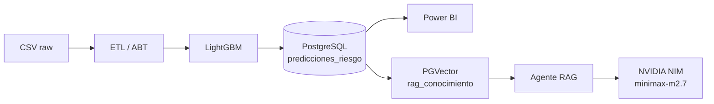

# 🏦 TumiPay — Risk Engine & Financial AI Advisor


> **Arquitectura diseñada por el autor.** Durante el desarrollo se utilizó GitHub Copilot (Claude Sonnet) como asistente de programación para acelerar la implementación de boilerplate, debugging y búsqueda de patrones de código. Todas las decisiones de diseño del sistema, la ingeniería de features y la arquitectura de datos son originales del autor.

## 📋 Tabla de Contenidos

1. [Resumen Ejecutivo](#1-resumen-ejecutivo)
2. [Arquitectura del Sistema](#2-arquitectura-del-sistema)
3. [Stack Tecnológico](#3-stack-tecnológico)
4. [Modelo de Riesgo — Resultados](#4-modelo-de-riesgo--resultados)
5. [Agente RAG Financiero](#5-agente-rag-financiero)
6. [Inicio Rápido](#6-inicio-rápido)
7. [Conectar Power BI](#7-conectar-power-bi)
8. [Base de Datos en la Nube (gratis)](#8-base-de-datos-en-la-nube-gratis)
9. [Variables de Entorno](#9-variables-de-entorno)

---

## 1. Resumen Ejecutivo

Este repositorio es el núcleo analítico de **TumiPay**, una fintech de crédito de consumo. El sistema integra tres capas:

| Capa | Componente | Resultado |
|---|---|---|
| **Datos** | ETL + ABT (Analytical Base Table) | 1.527 créditos, 29 features |
| **Riesgo** | Modelo LightGBM de predicción de mora | ROC-AUC **0.9844** · Accuracy **97%** |
| **IA Conversacional** | Agente RAG (LangGraph + PGVector + Minimax) | Consultas en lenguaje natural sobre el portafolio |

La metodología aplica **Clean Architecture**: la ingeniería de features, el entrenamiento y la capa de IA están completamente desacoplados y orquestados desde un único notebook maestro.

### Estrategia anti-data leakage

El target `es_moroso` se define como `1` si el crédito tiene **al menos una cuota con mora > 30 días** antes de la fecha de corte (`CUTOFF_DATE = 2026-04-30`). Ninguna variable calculada post-desembolso es visible al modelo en el momento de scoring, replicando condiciones reales de producción.

---

## 2. Arquitectura del Sistema

```
proyecto-data-scientist/
├── 0_Master_Pipeline.ipynb   # Orquestador principal (ETL → Train → DB → RAG)
├── src/
│   ├── config.py             # Configuración centralizada (pydantic-settings)
│   ├── ingesta.py            # Carga de CSV con tipado estricto
│   ├── procesamiento.py      # Limpieza por entidad (clientes, créditos, pagos)
│   ├── consolidacion.py      # Ingeniería de features → ABT
│   ├── train_mora.py         # Pipeline LightGBM (split, train, eval, export)
│   ├── rag_agent.py          # Agente RAG con LangGraph + PGVector
│   ├── main.py               # FastAPI — endpoints de scoring e inferencia
│   └── llm_expert.py         # Endpoint conversacional LLM
├── scripts/
│   └── populate_rag.py       # Indexa documentos en el vector store
├── data/
│   ├── raw/                  # CSVs originales (no versionados)
│   └── processed/            # ABT parquet (no versionado)
├── models/                   # modelo_mora.pkl (no versionado)
├── docker-compose.yml        # PostgreSQL 16 + pgvector
└── .env.example              # Plantilla de variables de entorno
```



---

## 3. Stack Tecnológico

| Categoría | Tecnología |
|---|---|
| Lenguaje | Python 3.14 |
| ML | LightGBM 4.6, scikit-learn |
| Orquestación IA | LangGraph, LangChain |
| Embeddings | `intfloat/multilingual-e5-small` (local, CPU) |
| LLM | NVIDIA NIM — `minimaxai/minimax-m2.7` |
| Vector Store | PostgreSQL 16 + pgvector |
| API | FastAPI + Uvicorn |
| Infraestructura | Docker Compose |
| Configuración | pydantic-settings v2 |

---

## 4. Modelo de Riesgo — Resultados

| Métrica | Valor |
|---|---|
| ROC-AUC (test) | **0.9844** |
| Accuracy | **97%** |
| Algoritmo | LightGBM (Gradient Boosting) |
| Clases | Balanceo nativo con `class_weight` |
| Features | 23 (score externo, relación cuota/ingreso, historial de pagos, …) |

**Top predictores de mora:**
1. `score_externo` — historial buró de crédito
2. `relacion_cuota_ingreso` — carga financiera relativa
3. `score_interno_originacion` — evaluación interna al desembolso
4. `monto_credito` — exposición total
5. `plazo_meses` — probabilidad acumulada por tiempo

---

## 5. Agente RAG Financiero

El agente responde preguntas en lenguaje natural sobre el portafolio usando un pipeline de dos nodos LangGraph:

```
pregunta → [retrieve: PGVector k=3] → [generate: Minimax LLM] → respuesta
```

El knowledge base incluye:
- **1.527 fichas de perfil** por crédito (features + predicción de mora)
- **Resumen estadístico del portafolio** (tasa de mora, desglose por producto y canal)
- **4 documentos de política** (clasificación de riesgo, productos, proceso de cobro, glosario)

Para repoblar el vector store con datos actualizados:
```bash
python scripts/populate_rag.py
```

---

## 6. Inicio Rápido

**Requisitos:** Docker, Python 3.11+, una API key de [NVIDIA NIM](https://build.nvidia.com)

```bash
# 1. Clonar y configurar
git clone https://github.com/<tu-usuario>/proyecto-data-scientist.git
cd proyecto-data-scientist
cp .env.example .env
# Editar .env y agregar NVIDIA_API_KEY

# 2. Levantar PostgreSQL
docker-compose up -d

# 3. Crear entorno virtual e instalar dependencias
python -m venv .venv
source .venv/bin/activate        # Linux/Mac
# .venv\Scripts\activate         # Windows
pip install -r requirements.txt

# 4. Ejecutar el pipeline completo
jupyter notebook 0_Master_Pipeline.ipynb
# Ejecutar todas las celdas en orden (Kernel → Restart & Run All)
```

---

## 7. Conectar Power BI

### Opción A — Local (recomendada para desarrollo)

Power BI Desktop se conecta directamente al contenedor Docker:

1. Abrir Power BI Desktop → **Obtener datos** → **Base de datos PostgreSQL**
2. Servidor: `localhost` · Puerto: `5432`
3. Base de datos: `tumipay_db`
4. Usuario: `root` · Contraseña: `root`
5. Tabla a importar: `predicciones_riesgo`

> El contenedor debe estar corriendo (`docker-compose up -d`) mientras Power BI esté abierto.

### Opción B — Power BI Service (nube)

Para publicar reportes en Power BI Service necesitas que la base de datos sea accesible desde internet. Ver sección siguiente para opciones gratuitas.

Una vez con la BD en la nube:
1. Configura un **On-premises Data Gateway** si usas Power BI Pro, o
2. Conecta Power BI directamente a la URL pública de la BD (Supabase/Neon la proveen).

> **¿Publico el .pbix en GitHub?** No es recomendable: los archivos `.pbix` son binarios que no se pueden revisar con `git diff`, pueden contener datos cacheados en texto plano, y ocupan mucho espacio. Lo que sí puedes versionar es el archivo de plantilla `.pbit` (sin datos) o capturas del dashboard en `docs/`.

---

## 8. Base de Datos en la Nube (gratis)

Para tener la BD accesible desde Power BI Service o desde cualquier lugar sin pagar:

| Plataforma | Free tier | Límite | Ideal para |
|---|---|---|---|
| **[Supabase](https://supabase.com)** | ✅ Siempre gratis | 500 MB · 2 proyectos | Este proyecto (1.527 filas ≈ 2 MB) |
| **[Neon](https://neon.tech)** | ✅ Siempre gratis | 512 MB · 1 proyecto | Branching de BD para dev/prod |
| **[Railway](https://railway.app)** | $5 crédito/mes | ~200 MB con uso moderado | Proyectos pequeños con tráfico |
| **[Render](https://render.com)** | ✅ 90 días gratis | 1 GB | Prototipado rápido |

**Recomendación: Supabase** — soporta `pgvector` de fábrica (necesario para el RAG), tiene conexión directa compatible con Power BI, y su free tier es permanente.

### Migrar a Supabase en 5 pasos

```bash
# 1. Crear proyecto en supabase.com y copiar la connection string
# 2. Exportar datos locales
pg_dump -h localhost -U root tumipay_db > tumipay_dump.sql

# 3. Importar en Supabase (desde su SQL Editor o psql)
psql "postgresql://postgres:<password>@db.<ref>.supabase.co:5432/postgres" < tumipay_dump.sql

# 4. Actualizar .env
DATABASE_URL=postgresql://postgres:<password>@db.<ref>.supabase.co:5432/postgres

# 5. Repoblar el vector store en el nuevo host
python scripts/populate_rag.py
```

---

## 9. Variables de Entorno

Copia `.env.example` a `.env` y completa los valores:

```bash
cp .env.example .env
```

| Variable | Requerida | Descripción |
|---|---|---|
| `DATABASE_URL` | ✅ | Connection string PostgreSQL |
| `NVIDIA_API_KEY` | ✅ | API key de [build.nvidia.com](https://build.nvidia.com) |
| `CUTOFF_DATE` | — | Fecha de corte del modelo (default: `2026-04-30`) |
| `LANGCHAIN_API_KEY` | Opcional | Telemetría LangSmith |
| `LANGCHAIN_TRACING_V2` | Opcional | `true` para activar trazas |

> **Seguridad:** `.env` está en `.gitignore` y nunca debe subirse al repositorio. El archivo `.env.example` es la única referencia pública.
