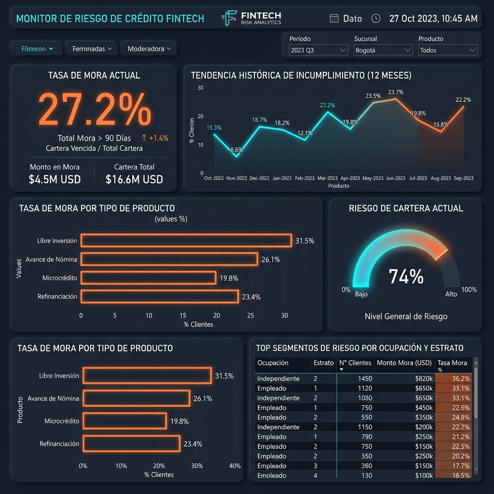

# Dashboard de Control de Riesgo de Crédito — TUMIPAY

Este panel de control analítico ha sido diseñado para monitorear en tiempo real la salud de la cartera de crédito y el comportamiento del riesgo de mora de **TUMIPAY** al corte del `2026-04-30`.

## Captura de Pantalla del Dashboard

---

## 1. Indicadores Clave de Rendimiento (KPIs)
* **Tasa de Mora Actual (27.2%)**: Proporción de créditos del portafolio que registran al menos una cuota en mora superior a los 30 días.
* **Monto en Mora ($4.5M USD)**: Exposición financiera total en estado de mora.
* **Cartera Total ($16.6M USD)**: Valor nominal total de colocaciones vigentes.
* **Nivel General de Riesgo (74%)**: Indicador de temperatura del portafolio que consolida la probabilidad acumulada de mora de los clientes vigentes.

## 2. Componentes y Visualizaciones
1. **Tendencia Histórica de Incumplimiento**: Un gráfico de líneas de 12 meses que permite analizar la evolución del default por cohorte mensual, identificando picos de riesgo (ej. cohortes de junio y julio).
2. **Tasa de Mora por Producto**: Gráfico de barras horizontales que desglosa el porcentaje de mora por producto. Revela que el producto **Libre Inversión** posee la mora más alta (31.5%), mientras que **Microcrédito** es el más sano (19.8%).
3. **Distribución de Riesgo de Cartera**: Un tacómetro (gauge chart) que visualiza el nivel de riesgo ponderado del portafolio (74%), clasificándolo en rango de monitoreo proactivo / cobro tardío.
4. **Top Segmentos de Riesgo por Ocupación y Estrato**: Tabla interactiva detallada para enfocar las estrategias de originación y cobranza. Los trabajadores **independientes en estrato 2** exhiben la tasa de mora más alta del portafolio (36.2%), acumulando una exposición de $820k USD.

## 3. Decisiones de Negocio Soportadas
* **Políticas de Aprobación Dinámicas**: Restringir la aprobación automática para perfiles con alta exposición en estrato 2 (ej. incrementar score interno mínimo requerido a 650).
* **Ajuste de Precios por Riesgo**: Incrementar la tasa de interés mensual de Libre Inversión o disminuir plazos para balancear la mora del 31.5%.
* **Estrategia de Cobro Preventiva**: Priorizar llamadas a clientes del segmento Independientes con score externo bajo en los primeros 3 días de vencimiento.
