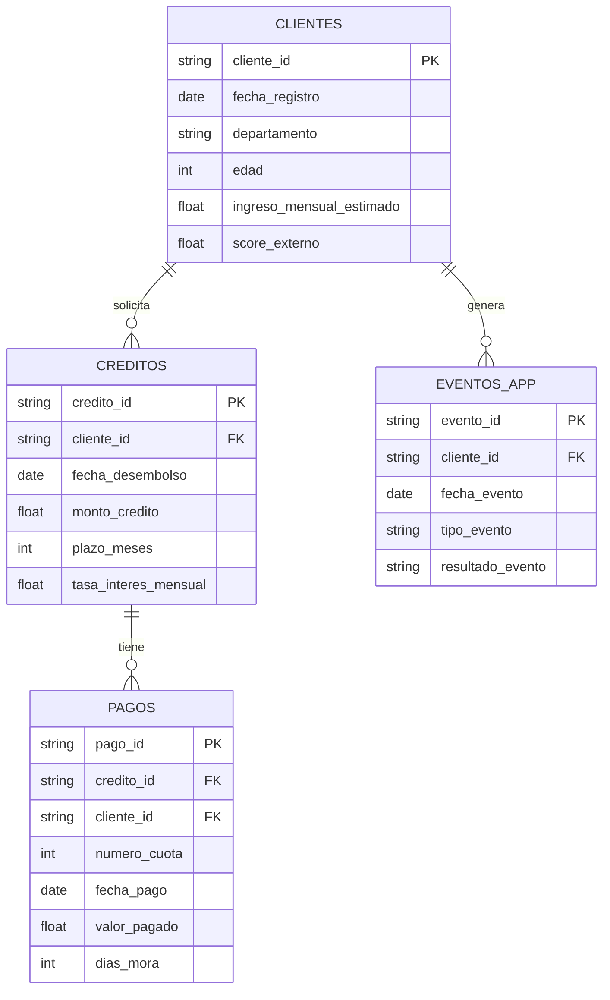

# Skills y Análisis de Datos (TUMIPAY)

## 1. Análisis de Consistencia de Datos
Con base en los archivos encontrados en `/data`, tenemos el siguiente modelo relacional estructurado para la prueba analítica:

1. **`clientes.csv`**:
   - Contiene la demografía base y el perfil del solicitante (`cliente_id` es llave primaria).
   - Variables clave: `edad`, `genero`, `estrato`, `ingreso_mensual_estimado`, `score_externo`.
2. **`creditos.csv`**:
   - Registra transacciones y aprobaciones operativas (`credito_id` como llave primaria, referenciado a `cliente_id`).
   - Variables clave: `monto_credito`, `plazo_meses`, `valor_cuota_pactada`, `canal_originacion`.
   - Útil para modelar capacidad de endeudamiento inicial.
3. **`pagos.csv`**:
   - Historial de cobranzas (`pago_id` primaria, enlaza con `credito_id` y `cliente_id`).
   - Variables clave: `valor_pagado`, `estado_pago`, `dias_mora`.
   - **Vital** para segmentar las ventanas de tiempo, aislar "Data Leakage" y derivar el **verdadero score de mora o _es_moroso_**.
4. **`eventos_app.csv`**:
   - Comportamiento de uso del dispositivo (`evento_id` primaria, enlaza con `cliente_id`).
   - Variables clave: `tipo_evento` ("simulacion_credito", "pago_fallido"), `duracion_sesion_seg`.
   - Excelente fuente adicional para *Data Leakage-free feature engineering* al crear un perfil neuro-transaccional (ej: número de veces que simula antes de pedir).

## 2. Diagrama de Relaciones de Entidades (ERD)

## 3. ¿Qué podemos usar para el Modelo?
Las siguientes características están perfiladas para la creación de variables sintéticas (Feature Engineering):
1. **Ratio de Deuda a Ingreso (`relacion_cuota_ingreso`) cruzado contra el `ingreso_mensual_estimado`**: Sirve como variable basal de default.
2. **Histórico de eventos fallidos (`pago_fallido`) desde `eventos_app.csv`**: Sirve como alerta temprana (early warning indicator) de fricción en la liquidez.
3. **Comportamiento histórico de `dias_mora` desde `pagos.csv`**: Podemos generar contadores "veces_mora_1_to_30_dias", "veces_mora_30_to_60_dias" agrupando pagos históricos antes del snapshot actual.
4. **`score_externo` (Buró central)**: Es el pilar fundamental que, sumado a las iteraciones de la APP, aumenta masivamente el poder predictivo del LightGBM.
